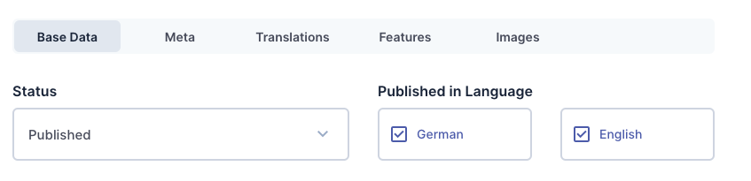

# Directus Tab Group Interface

<picture>
  <source media="(prefers-color-scheme: dark)" srcset="./docs/screenshot-dark.png">
  
</picture>

## Introduction

This extension provides a tab group interface as an alternative to the
accordion group interface.

## Installation

Add `directus-extension-group-tabs-interface` to your project:


```shell
# Using pnpm
pnpm add directus-extension-group-tabs-interface
# Using yarn
yarn add directus-extension-group-tabs-interface
# Using npm
npm install directus-extension-group-tabs-interface
```

## Usage

When creating a new field you can select `Tab Group` in the `Groups` section.

Alternatively you can change the interface of an existing group field in the
`Interface` section.
