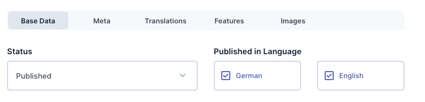

# ⚠️ Deprecation Notice
 
**This extension is deprecated and no longer maintained.**
 
The Tab Group interface originally provided by this community extension has been incorporated into **Directus Core** as of [**version 11.17.1**](https://github.com/directus/directus/releases/tag/v11.17.1). If you are running Directus 11.17.1 or later, you no longer need this extension — the tab group functionality is available out of the box.
 
### What should I do?
 
- **Upgrade Directus** to version 11.17.1 or later to use the built-in tab group interface.
- **Remove this extension** from your project once you have upgraded, either by uninstalling from the market place, or if installed via package manager:
  ```sh
  # Using pnpm
  pnpm remove directus-extension-group-tabs-interface
  # Using yarn
  yarn remove directus-extension-group-tabs-interface
  # Using npm
  npm uninstall directus-extension-group-tabs-interface
  ```

# Directus Tab Group Interface

A tab group interface for Directus.
This interface allows you to group fields into tabs as an alternative to
the default accordion group.

<picture>
  <source media="(prefers-color-scheme: dark)" srcset="./docs/screenshot-dark.png">
  
</picture>

## Installation

Add `directus-extension-group-tabs-interface` to your project:


```shell
# Using pnpm
pnpm add directus-extension-group-tabs-interface
# Using yarn
yarn add directus-extension-group-tabs-interface
# Using npm
npm install directus-extension-group-tabs-interface
```

## Usage

When creating a new field you can select `Tab Group` in the `Groups` section.

Alternatively you can change the interface of an existing group field in the
`Interface` section.

### Options

- `Overwrite Group Width`: If checked, force Directus to display the tab list in the "Fill Width" mode.
Normally, the width option is not available for groups, but so far no problems have been encountered. Please open an
issue if you encounter any visual bugs.

